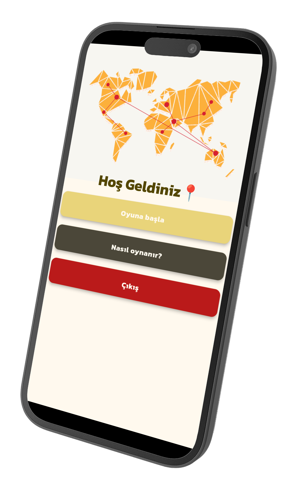
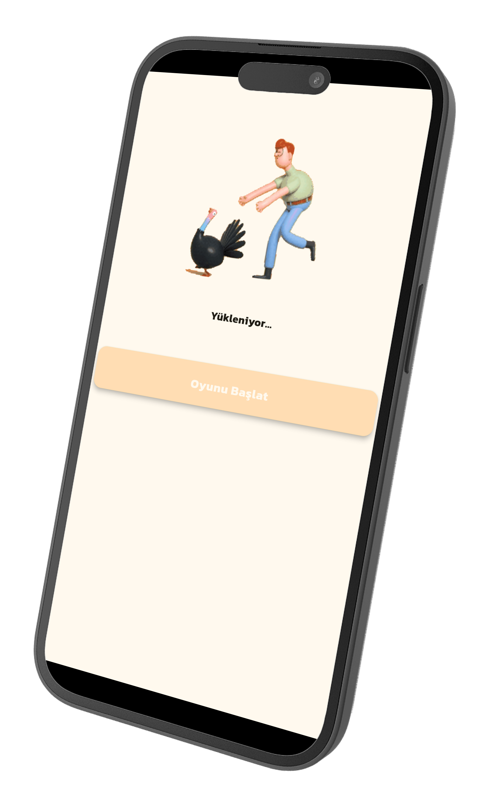
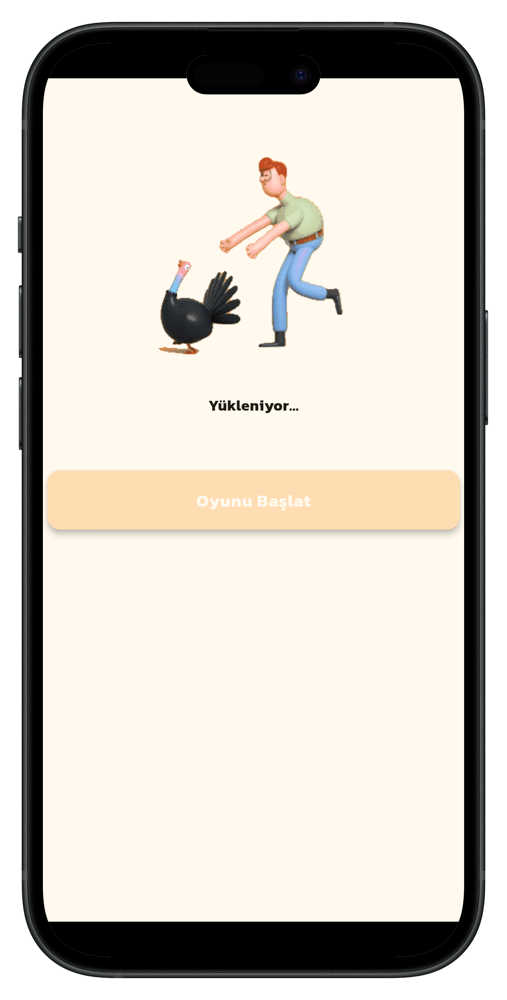
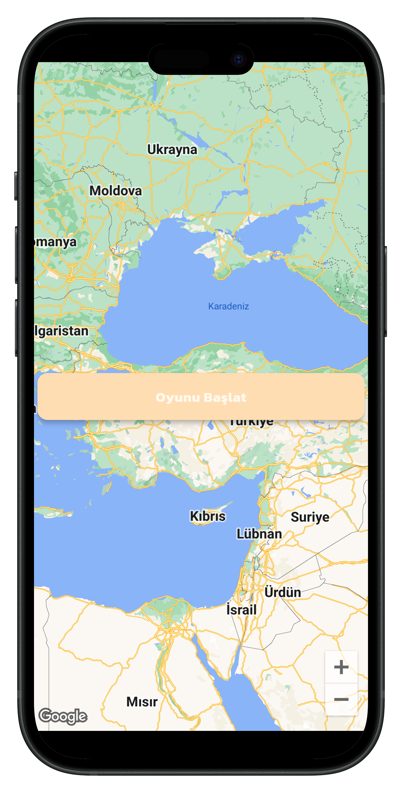
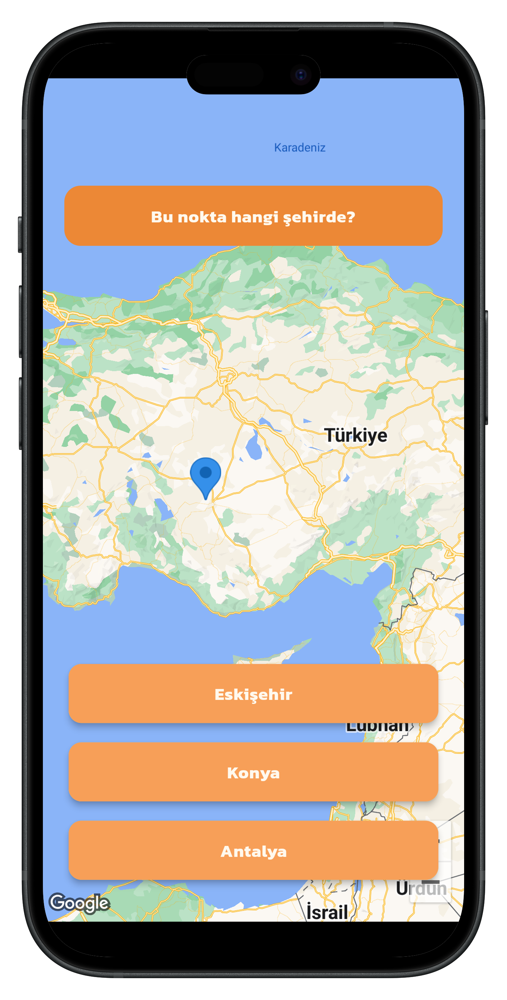
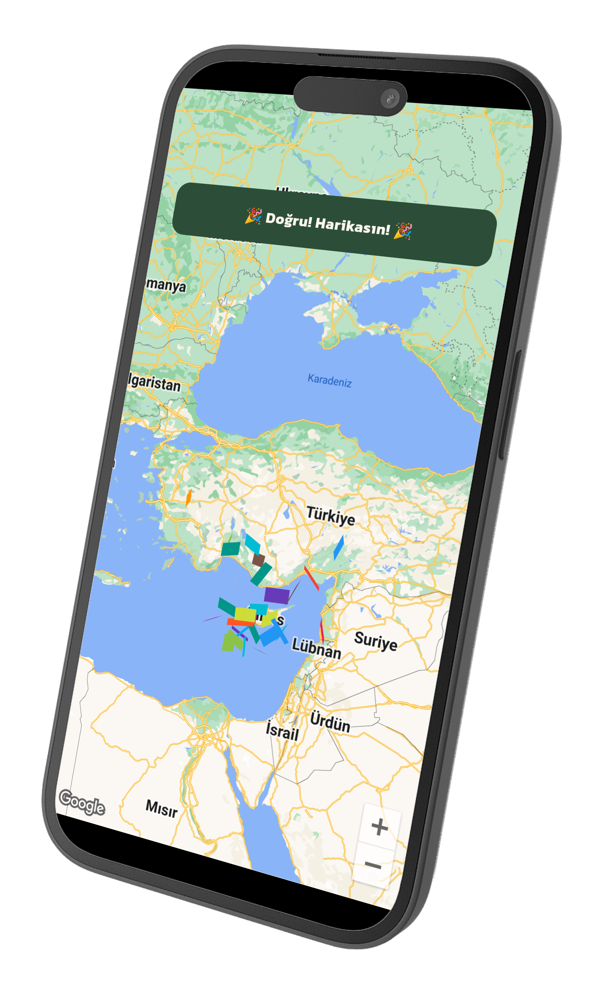
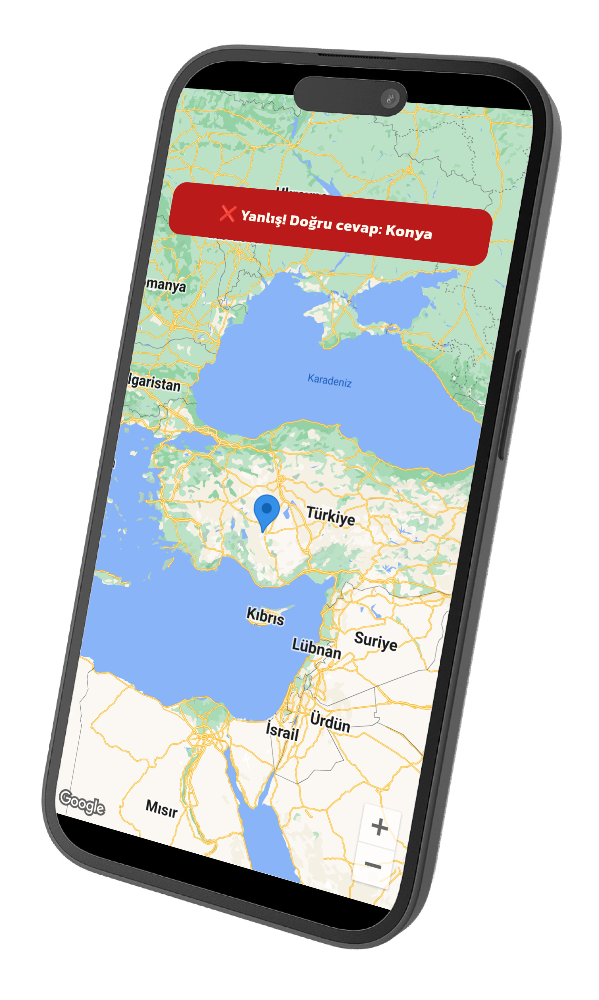

# City Guesser Game 🗺️

A captivating Flutter-based mobile game that tests your geographical knowledge by guessing cities based on Google Maps markers.

## 📱 Screenshots

<div align="center">
  
  
  
  
  
  
  
  
</div>

## 🌟 Features

- Interactive Google Maps integration with custom markers
- Engaging city guessing gameplay
- Visual and audio feedback system
- Celebration animations for correct answers
- Network-aware application with offline capabilities
- Clean, modular architecture following be


### Architecture
- **BLoC Pattern** for state management (flutter_bloc)
- **Provider** for dependency injection
- **GetIt** for service location
- Custom base classes (BaseView, BaseViewModel, BaseState)
- Atomic widget design for maximum reusability
- Modular structure for easy scalability


### Packages
```yaml
dependencies:
  provider: ^6.1.2 
  flutter_bloc: ^8.1.6
  equatable: ^2.0.7
  dio: ^5.7.0
  connectivity_plus: ^6.0.3
  confetti: ^0.8.0
  animated_text_kit: ^4.2.2
  google_maps_flutter: ^2.5.3
  audioplayers: ^5.2.1
  get_it: ^8.0.1
  logger: ^2.5.0
