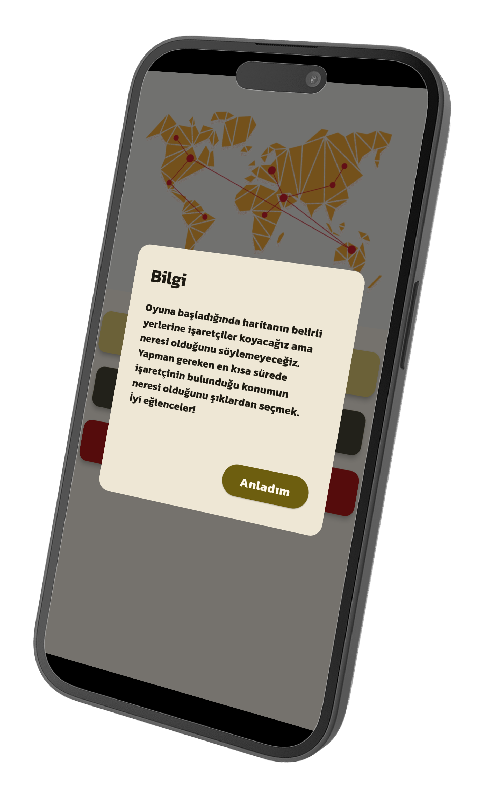

## 📱 Screenshots

  

    
    
<em>Figure 1: Splash Screen with Animated Intro</em>

  

  

    
    
<em>Figure 2: Main Game Screen with Map Marker</em>

  

  

    
    
<em>Figure 3: Correct Answer Celebration</em>

  

  

    
    
<em>Figure 4: Incorrect Answer Feedback</em>

  

  

    
    
<em>Figure 5: Level Completion Screen</em>

  

  

    
    
<em>Figure 6: Audio Settings Panel</em>

  

  

    
    
<em>Figure 7: Network Status Indicator</em>

  

  

    
    
<em>Figure 8: Theme Customization Options</em>

  

  

    
    
<em>Figure 9: Progress Tracking Dashboard</em>

  

